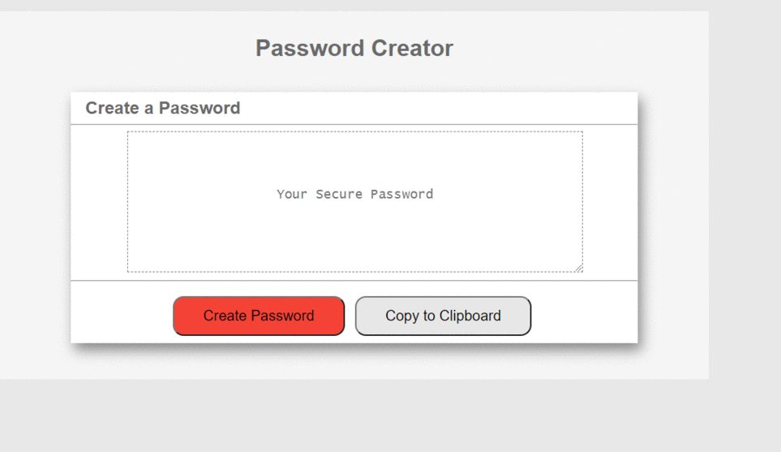

# Password-Creator

This is a project targeted for the assignment ( or homework) for Western Australia's UWA Bootcamp

This is a web app focussing on Javascript to create a random and secure password for the end user. 

This has been deployed to GitHub. To get this web app ( or project) up and running, one can follow the link(deployment).one can also download the file to use as template.
 
* [GitHub Repository](https://github.com/citenaresh/Password_Creator/)
* [Deployed GitHub IO](https://citenaresh.github.io/Password_Creator/index.html)

### what you need

To install this web app, a text editor is needed, my recommendation is for Visual Studio Code but even the notepad work as fine as VS Code. 

### how to install

for installing, You can download the zipped file, or You can clone from Github. 

### my project's Summary
* The documents(HTML, CSS and Javascript) generate a random password.
* The project focuses mainly on Javascript for creating dynamic and interactive HMTL document

### features: 
* A create button
    * This button will ask the user series of questions (in the form of prompts and confirms)
    * After the data(input), from the user, is collected, a random password will be generated using Javascript

* A Textarea
    * This box will display the users password when it is created after the user input

* A Copy button 
    * This will copy the users password to the user's devices clipboard

### The Psuedo Code for the Project: 
* The user will be prompted to choose the password from the following criteria: 8 and 128 characters
* The user will recieve a confirm for: 
    * Password containing special characters, numbers, and uppercase letters
    * Either 4 variables individual ones, or 3 with toLowerCase or Uppercase conversion
    * This will need to randomly select array item, therefore math.floor and math.random function is needed.     
* The application should validate user input and ensure that at least one character type is selected.
* Once all prompts are answered, the user will be presented with a password matching the responded prompts. Showing the created password.
* Event listener (click in this case) will determine the output password and populate into the text area.
* As a bonus, the user should also have the option to click a button to copy the password to their clipboard.
    * Copy execCommand in event listener

### This project has script features of:
* declaring Variable 
* An event listener (onclick) called createPassword
    * This will prompt the user for input between 8-128
    * This variable is changed to an interger using ParseInt()
    * This will validate that the input is a number.
    * This then uses the input to determine the choice of characters (uppercase, lowercase, special etc), using if statement.
    * This then assigns values to the variables using arrays for character, number or alphabet
* A for loop will loop through the prompts. 
* A variable for password get the value from the  loop, and converts to a string. 
* This value then populates into the text area for the user.

### This project has media Queries for:
* max-width: 980px 
    * Adjusts body and container width
* max-width: 786px
    * Adjusts body and container width
    * Adjusts buttons
* max-width: 640px
    * Adjusts body and container width
    * Adjusts buttons to be centered and stacked

### How To Execute the Files:
> The files should be Open in browser (now a days you just need to click or tap on the file :) )

### Features: 
* HTML Page
    * Index.html 
        * The main UI design
* CSS file
    * Styles.css
        * for the style of the page (index.html)
* Javascript file
        * The backbone to the web app, it does all the "thinking and executing process"of the "Password Creator"

## Authors

* **Naresh Raj Poudel** - [Git Hub Profile](URL)

## Acknowledgments

* Great gratitude to Luca, Sam and Renata from the UWA Bootcamp for their enormous help.
